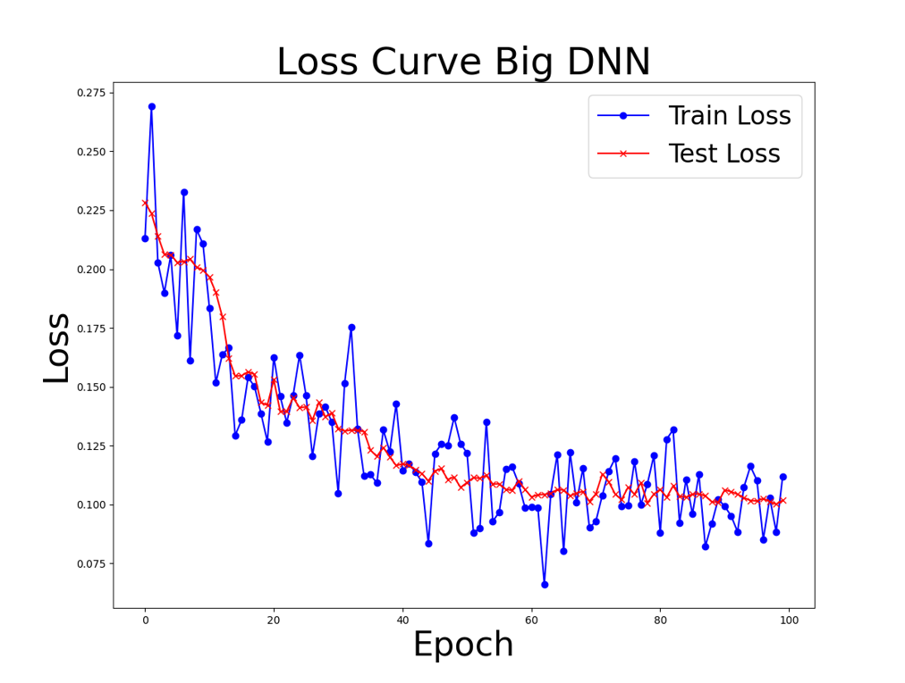
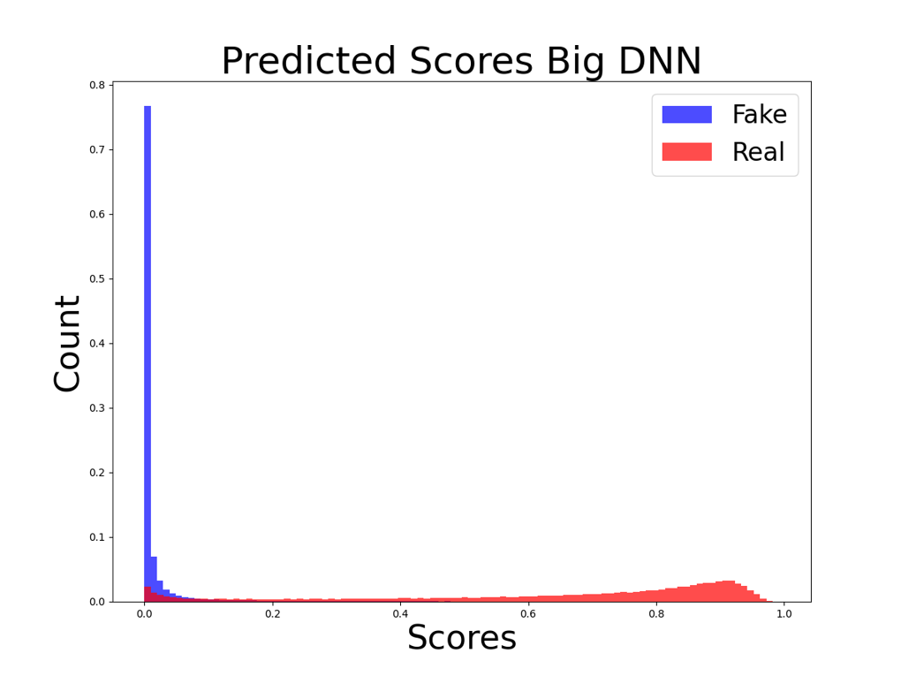
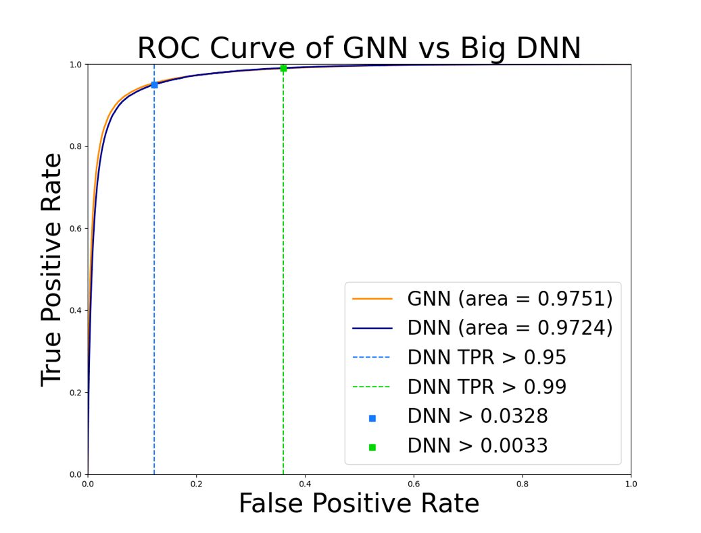

# Using Machine Learning for Particle Tracking at the Large Hadron Collider

Description: In this study, an advanced Deep Neural Network (DNN) was meticulously developed to process and analyze a dataset sourced from the Large Hadron Collider (LHC) experiment, utilizing data collected by the Compact Muon Solenoid (CMS) Detector. The main goal of the DNN was to employ cutting-edge line segment tracking techniques to predict the validity of particle tracks identified by the CMS Detector.

Given the presence of a magnetic field within the CMS Detector, charged particles resulting from collisions display curved paths. These curves hold vital information concerning the particles' charge and momentum. The DNN was intricately designed to process these curved trajectories, determining whether a specific track is reliable for further analysis or should be excluded due to inaccuracies.

In this investigation, we harnessed the capabilities of deep learning methodologies to enhance the precision and efficiency of particle track selection. This, in turn, contributed to the accuracy of charge and momentum determination within the CMS Detector.

Furthermore, we conducted an in-depth analysis using Receiver Operating Characteristic (ROC) curves to compare the performance of our DNN with a Graph Neural Network (GNN) in track prediction. We employed techniques such as histograms, loss curves, and F1 scores to identify optimal threshold values. Notably, our findings revealed that the performance of the simplest DNN model was comparable to more complex variants like the GNN that consisted of 3 neural networks that we compared it too.

In conclusion, this study demonstrated the remarkable potential of the developed DNN in enhancing particle track selection within the CMS Detector. The utilization of various analytical tools, including ROC curves and threshold optimization techniques, further underscored the effectiveness of our approach and highlighted the competitiveness of even the simplest DNN architecture.

# Credits
* Frank Wuerthwein (PI)
* Jonathan Guiang (mentor)
* Alejandro Dennis
* Abraham Flores
